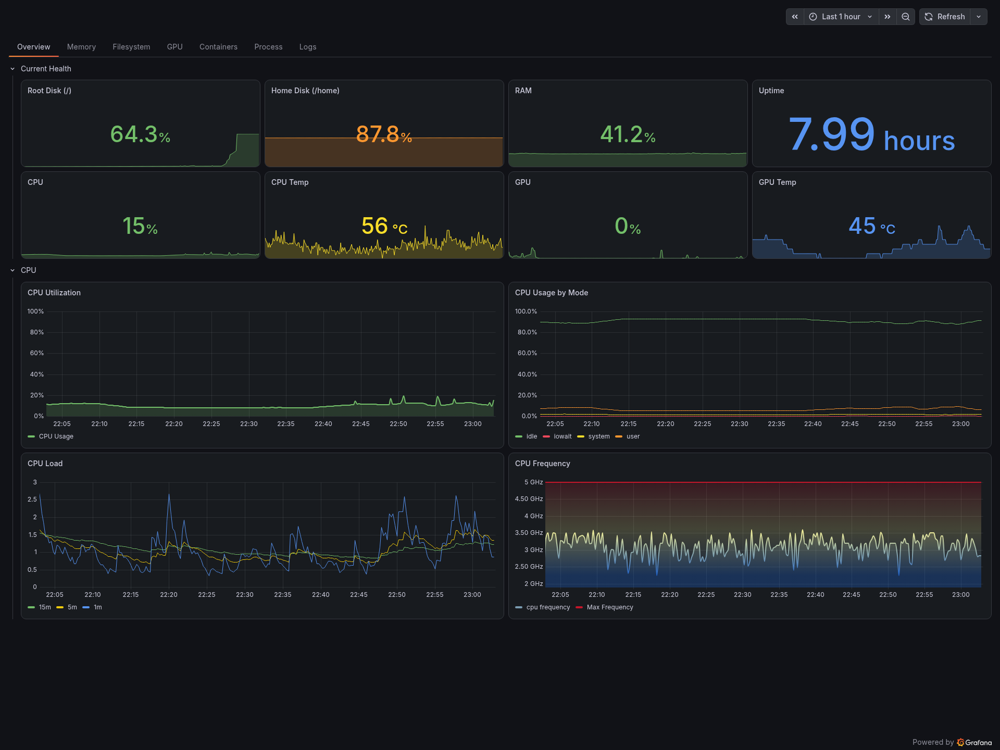
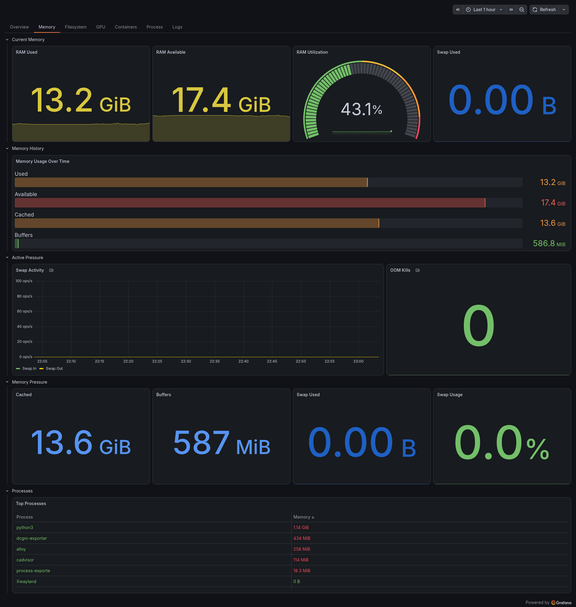
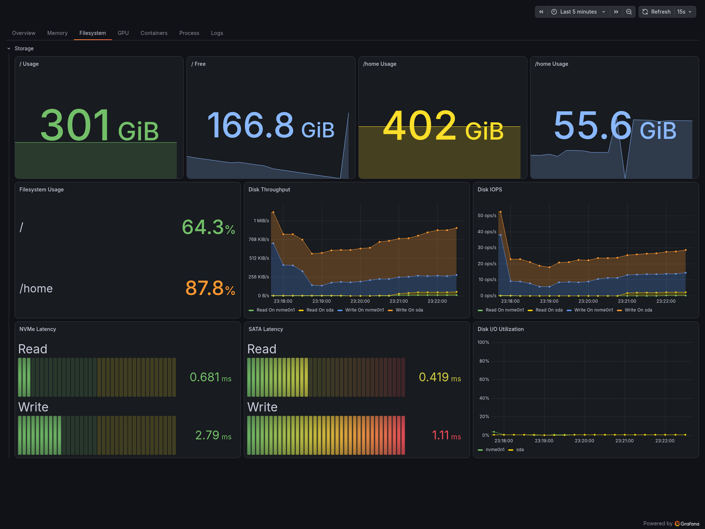
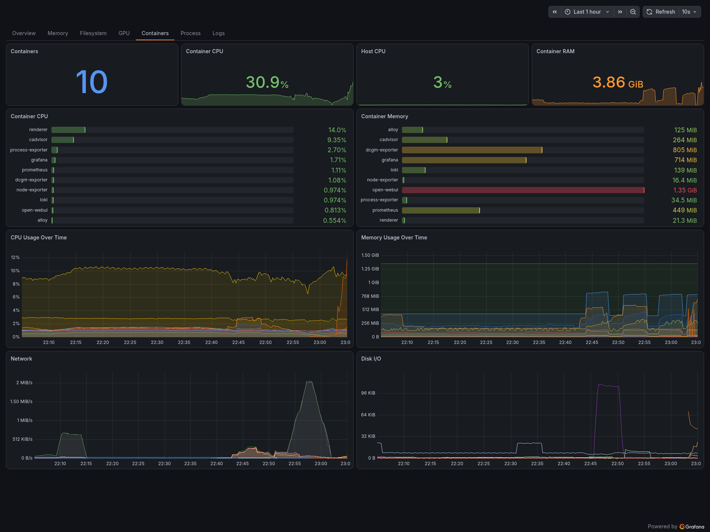
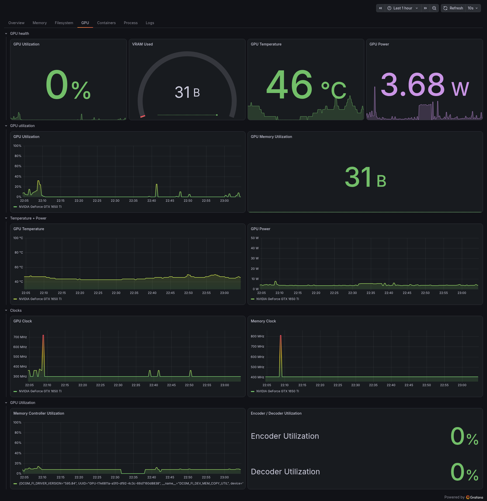
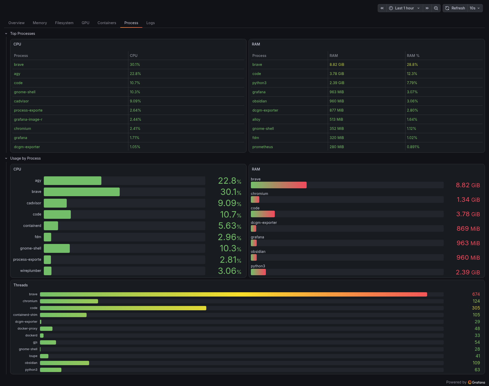
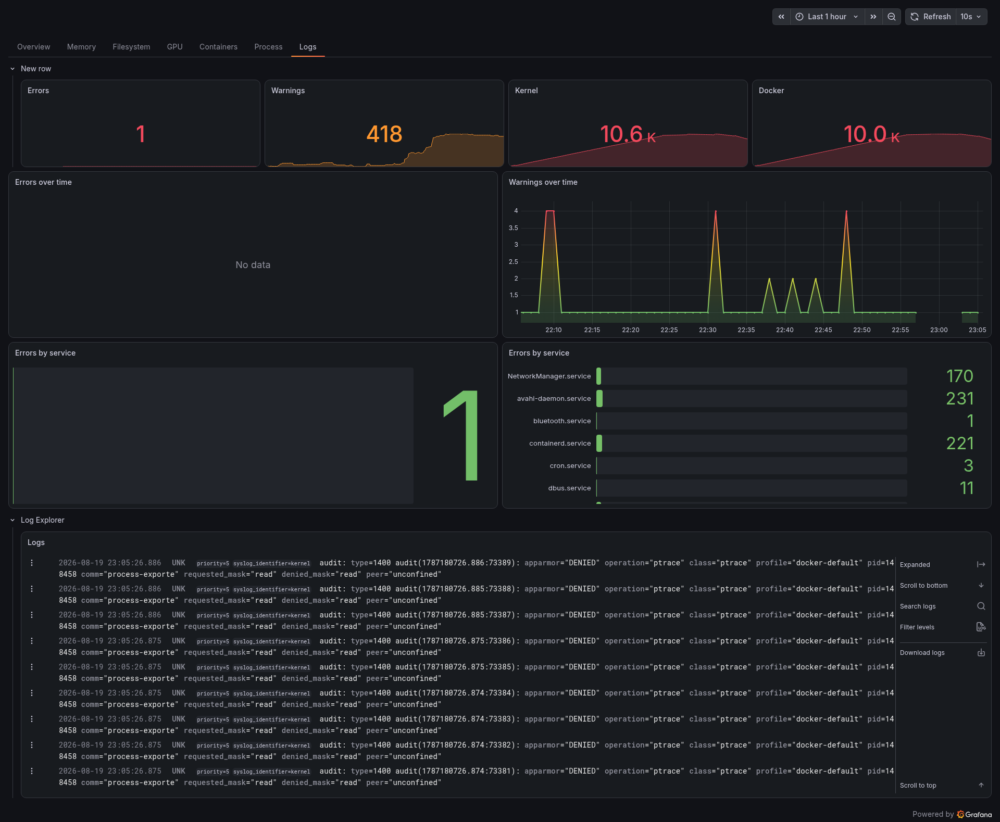

# 🖥️ Laptop Observability Stack

A full observability platform for an Ubuntu laptop, built with the Grafana LGTM stack and deployed via Docker Compose. Rather than relying on a hosted solution, the goal was to build something closer to what you'd find in a production environment — complete visibility into CPU, memory, storage, network, GPU, containers, processes, and system logs, all accessible from a single Grafana instance running locally.

---

## 📸 Dashboards

| Dashboard | Screenshot |
|---|---|
| **Overview** — at-a-glance laptop health |  |
| **Memory & Storage** — RAM breakdown, swap, disk |  |
| **Filesystem** — per-mount usage, IOPS, throughput |  |
| **Docker & Containers** — per-container CPU/RAM/network |  |
| **GPU** — NVIDIA utilization, VRAM, temp, power, clocks |  |
| **Processes** — top processes by CPU and memory |  |
| **Logs** — live systemd journal via Loki |  |

---

## 🏗️ Architecture

```text
                         ┌─────────────────────┐
                         │       Grafana       │
                         │        :3000        │
                         └──────────┬──────────┘
                                    │
                    ┌───────────────┴───────────────┐
                    │                               │
             ┌──────▼──────┐                 ┌──────▼──────┐
             │ Prometheus  │                 │    Loki     │
             │    :9090    │                 │    :3100    │
             └──────┬──────┘                 └──────▲──────┘
                    │                               │
        ┌───────────┼──────────────┐                │
        │           │              │                │
        ▼           ▼              ▼              Alloy
  node-exporter  process-    dcgm-exporter    (journal logs)
     :9100       exporter       :9400               │
                  :9256                       systemd journal
        │
        ▼
     cAdvisor
      :8090
```

Grafana sits at the top and queries two backends: Prometheus for metrics and Loki for logs. Prometheus scrapes four exporters — Node Exporter for host-level metrics, Process Exporter for per-process visibility, cAdvisor for Docker container metrics, and DCGM Exporter for GPU telemetry. On the logging side, Grafana Alloy reads the systemd journal directly from the host and forwards enriched log streams to Loki.

### Components

| Component | Role | Image |
|---|---|---|
| **Node Exporter** | Host CPU, RAM, disk, network, sensors | `docker.io/prom/node-exporter:v1.12.1` |
| **Process Exporter** | Per-process CPU, memory, thread counts | `docker.io/ncabatoff/process-exporter:v0.8.7` |
| **cAdvisor** | Docker container resource metrics | `gcr.io/cadvisor/cadvisor:v0.55.1` |
| **DCGM Exporter** | NVIDIA GPU utilization, VRAM, temperature, power | `nvcr.io/nvidia/k8s/dcgm-exporter:4.5.2-4.8.1-ubuntu22.04` |
| **Grafana Alloy** | Collects systemd journal logs | `docker.io/grafana/alloy:v1.18.1` |
| **Loki** | Log storage and query engine | `docker.io/grafana/loki:3.7.6` |
| **Prometheus** | Metrics storage and query engine | `docker.io/prom/prometheus:v3.13.2` |
| **Grafana Image Renderer** | Server-side image rendering plugin | `docker.io/grafana/grafana-image-renderer:v5.12.1` |
| **Grafana** | Visualization and dashboards | `docker.io/grafana/grafana:13.1.3` |

### Hardware

| | |
|---|---|
| **CPU** | 12 logical cores |
| **RAM** | 32 GB |
| **Storage** | NVMe (`/`) + SDD SATA (`/home`) |
| **GPU** | NVIDIA GeForce GTX 1650 Ti, 4 GB VRAM |
| **OS** | Ubuntu (Linux) |

---

## ⚙️ Configuration

### Docker Compose

All services are defined in a single [`compose.yml`](compose.yml). The general approach was to give each component only the access it actually needs — no service runs with `privileged: true`. Node Exporter is the one exception to the normal Docker networking model: it runs with `network_mode: host` and `pid: host` so it can see the real host network interfaces and process namespace, rather than the container's. Every other exporter communicates over the default Compose bridge network using service names.

Because Node Exporter is on the host network, Prometheus cannot reach it using a container service name. Instead, Prometheus is given a host gateway entry via `extra_hosts`, and the scrape target is set to `host.docker.internal:9100`.

### Prometheus — [`prometheus/prometheus.yml`](prometheus/prometheus.yml)

Scrapes four targets at 15-second intervals:

```yaml
scrape_configs:
  - job_name: 'node'
    static_configs:
      - targets: ['host.docker.internal:9100']

  - job_name: 'process'
    static_configs:
      - targets: ['process-exporter:9256']

  - job_name: 'cadvisor'
    static_configs:
      - targets: ['cadvisor:8080']

  - job_name: 'dcgm'
    static_configs:
      - targets: ['dcgm-exporter:9400']
```

### Loki — [`loki/loki-config.yml`](loki/loki-config.yml)

Configured for single-node use with TSDB schema v13 and filesystem-backed chunk storage. The ring KV store is set to `inmemory` — this only affects coordination state, not log data, which is still written to a persistent Docker volume.

### Alloy — [`alloy/config.alloy`](alloy/config.alloy)

Alloy reads the Ubuntu systemd journal and ships entries to Loki with additional labels extracted from journal metadata. The relabeling pipeline promotes three journald fields to queryable Loki labels:

| Loki Label | Journald Field | Example Value |
|---|---|---|
| `unit` | `_SYSTEMD_UNIT` | `docker.service` |
| `syslog_identifier` | `SYSLOG_IDENTIFIER` | `dockerd` |
| `priority` | `PRIORITY` | `6` |

This makes it easy to filter logs in Grafana by service unit, identifier, or severity without scanning full log lines.

### Auto-Provisioning (Dashboards & Datasources as Code)

To make the environment completely reproducible and resilient across volume rebuilds, Grafana is configured with automatic file provisioning:

- **Datasources:** [`grafana/provisioning/datasources/datasources.yml`](grafana/provisioning/datasources/datasources.yml) automatically registers Prometheus (`http://prometheus:9090`) and Loki (`http://loki:3100`) with immutable UIDs on startup.
- **Dashboards:** [`grafana/provisioning/dashboards/dashboards.yml`](grafana/provisioning/dashboards/dashboards.yml) configures a file provider that watches `/etc/grafana/dashboards` (mounted from [`grafana/dashboards`](grafana/dashboards)) and automatically loads all JSON dashboard definitions.

This enables a zero-touch setup where dashboards and datasources are immediately available upon `docker compose up -d` without requiring manual web UI imports.

---

## 🚀 Quick Start

**Prerequisites:** Docker with the Compose plugin installed. For GPU monitoring, the NVIDIA Container Toolkit must also be installed and configured.

```bash
git clone <repo-url>
cd monitoring
docker compose up -d
```

Once running:

- **Grafana** → http://localhost:3000
- **Prometheus** → http://localhost:9090
- **Loki** → http://localhost:3100

---

## 🔍 Technical Challenges

Setting up a monitoring stack from scratch — especially one that spans host metrics, GPU telemetry, container metrics, and log collection — involves a number of problems that aren't immediately obvious. The issues encountered and how they were resolved are documented here.

---

### 1. Node Exporter Reporting Wrong Network Interfaces

The first sign something was off came from the network dashboard. Queries against `node_network_receive_bytes_total` returned `eth0` and `lo`, but the machine's actual Wi-Fi adapter is `wlp5s0` and its Ethernet port is `enp4s0`. Neither appeared.

The cause turned out to be straightforward once understood: Node Exporter was running inside the Docker Compose bridge network and was therefore reporting on its *own* container's network namespace, not the host's. From inside the container, `eth0` is the Docker virtual interface — which has nothing to do with the physical hardware.

The fix is to run Node Exporter directly in the host network namespace using `network_mode: host`, combined with `pid: host` and a bind mount of the root filesystem so it can read host-level `/proc` and `/sys` data:

```yaml
node-exporter:
  network_mode: host
  pid: host
  command:
    - "--path.rootfs=/host"
  volumes:
    - "/:/host:ro,rslave"
```

This change required updating the Prometheus scrape config as well, since `node-exporter:9100` (a Docker service name) no longer resolves. The solution is to add a host gateway entry to the Prometheus service and point the scrape target at `host.docker.internal:9100`:

```yaml
# compose.yml
prometheus:
  extra_hosts:
    - "host.docker.internal:host-gateway"
```

```yaml
# prometheus.yml
- job_name: 'node'
  static_configs:
    - targets: ['host.docker.internal:9100']
```

After the change, `wlp5s0` appeared in Node Exporter's metrics as expected.

---

### 2. Loki Failing to Start (Ring/KV Error)

On first startup, Loki exited immediately with:

```
Get "http://localhost:8500/v1/kv/collectors/scheduler": dial tcp [::1]:8500: connect: connection refused
unable to initialise ring state
```

Loki uses a distributed ring to coordinate between instances — for things like token ownership and replication state. By default, it tries to store this ring state in Consul. There is no Consul running here, nor is there any need for one on a single-node laptop setup.

The fix is to switch the ring KV store to `inmemory`, which keeps all coordination state local to the Loki process. It's important to understand what "in-memory" means in this context: it only applies to the ring/KV coordination layer. The actual log chunks are still written to disk via the filesystem storage backend — no log data is lost if Loki restarts.

```yaml
common:
  ring:
    kvstore:
      store: inmemory
  replication_factor: 1
```

With that change in place, Loki started cleanly and passed its readiness check at `http://localhost:3100/ready`.

---

### 3. Process Exporter AppArmor and ptrace Permissions

When running Process Exporter in a container to monitor host processes, mounting `/proc` is only the first step. Inspecting detailed process metrics (such as memory mapping, command lines, and thread statistics across different host UIDs) requires `ptrace` read access.

Initial startup attempts triggered kernel AppArmor audit denials:

```
apparmor="DENIED" operation="ptrace" profile="docker-default"
requested_mask="read" denied_mask="read" peer="unconfined"
```

This highlighted a key distinction between **Linux Capabilities** and **Linux Security Modules (LSMs)**:
- Adding the `SYS_PTRACE` capability (`cap_add: [SYS_PTRACE]`) grants the process permission at the capability layer.
- However, Docker applies its default AppArmor profile (`docker-default`) to all containers, which explicitly denies `ptrace` operations at the Mandatory Access Control (MAC) layer—blocking the operation before capabilities are even checked.

To resolve this, the container must be run in the host PID namespace with the host `/proc` filesystem mounted, and the default AppArmor restrictions unconfined for that container:

```yaml
process-exporter:
  pid: host
  security_opt:
    - apparmor=unconfined
  volumes:
    - /proc:/host/proc:ro
    - ./process-exporter/config.yml:/config/config.yml:ro
  command:
    - "--procfs=/host/proc"
    - "--config.path=/config/config.yml"
```

With `apparmor=unconfined` set specifically on `process-exporter`, the kernel audit denials ceased and the exporter was able to scrape the full tree of host processes without requiring full container `--privileged` mode.

---

### 4. DCGM Exporter Unstable `hostname` Label

DCGM Exporter adds a `hostname` label to every metric it emits. On the surface this seems reasonable, but in practice the value it reports is the Docker container's hostname — and when no explicit hostname is set, Docker defaults to using the container ID (a random hex string like `ee891a0c4bd5`).

This creates a label churn problem. Every time the container is recreated — which happens on `docker compose down && up` — a new container ID is assigned, producing a new `hostname` value. From Prometheus's perspective, this looks like a new series, breaking continuity in graphs and potentially accumulating stale series over time.

The two-part fix is to set a stable hostname on the container so the label stays consistent, and to use the GPU UUID as the true identity in dashboard queries:

```yaml
# compose.yml
dcgm-exporter:
  hostname: laptop
```

```promql
-- Prefer UUID over hostname for filtering
max without(hostname) (DCGM_FI_DEV_GPU_UTIL)
```

If the `hostname` label isn't needed in dashboards at all, it can be dropped at scrape time with a metric relabeling rule in Prometheus, which prevents it from ever being stored:

```yaml
# prometheus.yml
metric_relabel_configs:
  - action: labeldrop
    regex: hostname
```

The GPU UUID (`GPU-f7e6811a-a5f0-df92-4c3c-66d7160d8838`) is the stable, hardware-bound identity and is the right thing to use when you need to uniquely identify the physical GPU.

---

### 5. Alloy Failing on Initial Config Load

Alloy refused to start and immediately exited with:

```
Error: could not perform the initial load successfully
```

There were three separate problems in the initial configuration, all compounding each other.

The first was a misuse of the `replace` relabeling rule. The `regex` field was being used as if it specified the destination label name — but that's what `target_label` is for. `regex` is a match pattern applied to the source value, not the name of the output label.

The second was a wiring problem. The `loki.relabel` component was defined but never connected to the journal source. `loki.source.journal` was configured to send directly to `loki.write`, which meant the relabeling rules were never applied — they were just dead configuration.

The third was an incorrect internal label name. The `SYSLOG_IDENTIFIER` journald field should be referenced as `__journal_syslog_identifier` in Alloy. The initial config had `__journal_syslog_identifier__` with a trailing double underscore, which doesn't match any valid label.

One detail worth documenting here is the naming convention for Alloy's journald internal labels, since it's not immediately obvious from the docs:

- Journald fields that start with `_` (trusted kernel fields, like `_SYSTEMD_UNIT`) map to Alloy labels with a double underscore separator: `__journal__systemd_unit`
- Journald fields without a leading `_` (user fields, like `SYSLOG_IDENTIFIER` and `PRIORITY`) map with a single underscore separator: `__journal_syslog_identifier`, `__journal_priority`

Once all three issues were fixed, Alloy started cleanly and journal entries began appearing in Loki with the expected labels.

---

### 6. Grafana Showing Two Instance Labels Simultaneously

After switching the Node Exporter scrape target from `node-exporter:9100` to `host.docker.internal:9100`, Grafana panels started showing data from both instance values at the same time. The immediate assumption was that Grafana or Prometheus still had a stale reference to the old target somewhere.

After checking dashboard variables, panel queries, transformations, and the Prometheus datasource configuration — everything looked correct. Running `up` and `count by (instance) (node_uname_info)` in Prometheus Explore confirmed that only `host.docker.internal:9100` was an active scrape target.

The explanation is that the old values weren't from a misconfiguration — they were historical samples. Prometheus doesn't retroactively relabel stored data when a scrape target changes. Samples collected before the change still carry `instance="node-exporter:9100"`, and those samples remain in storage until they fall outside the retention window. When the dashboard time range spans the period before and after the target change, both label values legitimately appear in the same query result.

No configuration change was needed. The old label simply ages out of retention naturally. For day-to-day use, setting the default dashboard time range to something like "Last 6 hours" or "Last 24 hours" avoids spanning the transition period.

---

## 📊 Dashboard Design

The dashboards are designed around a specific idea: rather than being a collection of interesting metrics, they should function as an investigation path. If the laptop feels slow, the goal is to be able to open Grafana and drill down to the root cause without guesswork.

```
Overview:  CPU = 96%
    ↓
Process dashboard:  java = 78%
    ↓
Container dashboard:  spring-app = 76%
    ↓
Logs dashboard:  DB connection timeout errors
```

Each dashboard is scoped to answer one question clearly, and then point toward the next level of detail when something looks wrong:

| Dashboard | Primary Question |
|---|---|
| Overview | Is my laptop healthy right now? |
| Memory & Storage | What is consuming RAM or disk? |
| Filesystem | How are my drives performing? |
| Docker & Containers | Which container is consuming resources? |
| GPU | What is my GPU doing? |
| Processes | Which application/process is the cause? |
| Logs | Why is something misbehaving? |

---

## 🔧 Stack Versions

| Component | Pinned Version / Full Image Tag |
|---|---|
| Grafana | `docker.io/grafana/grafana:13.1.3` |
| Prometheus | `docker.io/prom/prometheus:v3.13.2` |
| Loki | `docker.io/grafana/loki:3.7.6` |
| Alloy | `docker.io/grafana/alloy:v1.18.1` |
| Node Exporter | `docker.io/prom/node-exporter:v1.12.1` |
| Process Exporter | `docker.io/ncabatoff/process-exporter:v0.8.7` |
| cAdvisor | `gcr.io/cadvisor/cadvisor:v0.55.1` |
| DCGM Exporter | `nvcr.io/nvidia/k8s/dcgm-exporter:4.5.2-4.8.1-ubuntu22.04` |
| Image Renderer | `docker.io/grafana/grafana-image-renderer:v5.12.1` |
